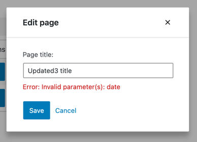
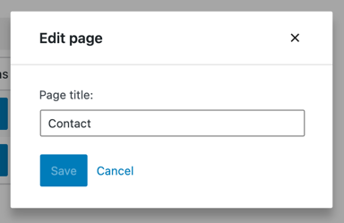
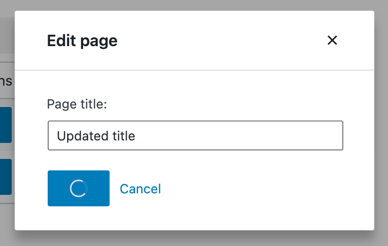

<!--
# Building an edit form
-->
# 編集フォームの構築

<!--
This part is about adding an *Edit* feature to our app. Here's a glimpse of what we're going to build:
-->
このパートでは、アプリに *編集* 機能を追加します。以下はその完成した様子です。

<!--

-->


<!--
### Step 1: Add an _Edit_ button
-->
### ステップ 1: 「編集」ボタンの追加

<!--
We can't have an *Edit* form without an *Edit* button, so let's start by adding one to our `PagesList` component:
-->
「編集」ボタンがなければ、「編集」フォームもありませんので、`PagesList` コンポーネントにボタンを追加するところから始めます。


```js
import { Button } from '@wordpress/components';
import { decodeEntities } from '@wordpress/html-entities';

const PageEditButton = () => (
	<Button variant="primary">
		Edit
	</Button>
)

function PagesList( { hasResolved, pages } ) {
	if ( ! hasResolved ) {
		return <Spinner />;
	}
	if ( ! pages?.length ) {
		return <div>No results</div>;
	}

	return (
		<table className="wp-list-table widefat fixed striped table-view-list">
			<thead>
				<tr>
					<td>Title</td>
					<td style={{width: 120}}>Actions</td>
				</tr>
			</thead>
			<tbody>
				{ pages?.map( ( page ) => (
					<tr key={page.id}>
						<td>{ decodeEntities( page.title.rendered ) }</td>
						<td>
							<PageEditButton pageId={ page.id } />
						</td>
					</tr>
				) ) }
			</tbody>
		</table>
	);
}
```

<!--
The only change in `PagesList` is the additional column labeled _Actions_:
-->
`PagesList` の唯一の変更点は、ラベル「Actions」のカラムの追加です。

<!--

-->


<!--
### Step 2: Display an _Edit_ form
-->
### ステップ 2: 「編集」フォームの表示

<!--
Our button looks nice but doesn't do anything yet. To display an edit form, we need to have one first – let's create it:
-->
このボタンは見た目はきれいですが、まだ何もできません。編集フォームを表示するには、まず、フォームを用意する必要があります。

```js
import { Button, TextControl } from '@wordpress/components';
export function EditPageForm( { pageId, onCancel, onSaveFinished } ) {
	return (
		<div className="my-gutenberg-form">
			<TextControl
				value=''
				label='Page title:'
			/>
			<div className="form-buttons">
				<Button onClick={ onSaveFinished } variant="primary">
					Save
				</Button>
				<Button onClick={ onCancel } variant="tertiary">
					Cancel
				</Button>
			</div>
		</div>
	);
}
```

<!--
Now let's make the button display the form we just created. As this tutorial is not focused on web design, we will wire the two together using a component that requires the least amount of code: [`Modal`](https://developer.wordpress.org/block-editor/reference-guides/components/modal/). Let's update `PageEditButton` accordingly:
-->
そして、ボタンと、作成したフォームの表示を結びつけます。このチュートリアルはウェブデザインに焦点を当てたものではありませんので、最も少ないコードで済む [`Modal`](https://developer.wordpress.org/block-editor/reference-guides/components/modal/) コンポーネントを使用して2つを接続します。`PageEditButton` を更新します。

```js
import { Button, Modal, TextControl } from '@wordpress/components';

function PageEditButton({ pageId }) {
	const [ isOpen, setOpen ] = useState( false );
	const openModal = () => setOpen( true );
	const closeModal = () => setOpen( false );
	return (
		<>
			<Button
				onClick={ openModal }
				variant="primary"
			>
				Edit
			</Button>
			{ isOpen && (
				<Modal onRequestClose={ closeModal } title="Edit page">
					<EditPageForm
						pageId={pageId}
						onCancel={closeModal}
						onSaveFinished={closeModal}
					/>
				</Modal>
			) }
		</>
	)
}
```

<!--
When you click the *Edit* button now, you should see the following modal:
-->
「編集」ボタンをクリックすると、次のモーダルが表示されます。

<!--

-->


<!--
Great! We now have a basic user interface to work with.
-->
いいですね。これで基本的なユーザーインターフェイスができました。

<!--
### Step 3: Populate the form with page details
-->
### ステップ 3: フォームへのページの詳細の挿入

<!--
We want the `EditPageForm` to display the title of the currently edited page. You may have noticed that it doesn't receive a `page` prop, only `pageId`. That's okay. Gutenberg Data allows us to easily access entity records from any component.
-->
`EditPageForm` には、現在編集中のページのタイトルを表示するつもりですが、見て分かるように `page` ではなく、`pageId` プロパティしか受け取りません。でも大丈夫。Gutenberg Data を使えば、どのコンポーネントからでも簡単にエンティティレコードにアクセスできます。

<!--
In this case, we need to use the [`getEntityRecord`](/docs/reference-guides/data/data-core/#getentityrecord) selector. The list of records is already available thanks to the `getEntityRecords` call in `MyFirstApp`, so there won't even be any additional HTTP requests involved – we'll get the cached record right away.
-->
この場合、[`getEntityRecord`](https://developer.wordpress.org/block-editor/reference-guides/data/data-core/#getentityrecord) セレクタを使用する必要があります。`MyFirstApp` の `getEntityRecords` 呼び出しのおかげで、レコードのリストはすでに利用可能で、追加の HTTP リクエストは必要ありません。キャッシュされたレコードをすぐに取得できます。

<!--
Here's how you can try it in your browser's dev tools:
-->
ブラウザの開発ツールの中でも試すことができます。

<!-- 
```js
wp.data.select( 'core' ).getEntityRecord( 'postType', 'page', 9 );  // Replace 9 with an actual page ID
```
 -->
```js
wp.data.select( 'core' ).getEntityRecord( 'postType', 'page', 9 );  // 「9」は実際のページ ID で置換する
```

<!--
Let's update `EditPageForm` accordingly:
-->
`EditPageForm` を更新します。

```js
export function EditPageForm( { pageId, onCancel, onSaveFinished } ) {
	const page = useSelect(
		select => select( coreDataStore ).getEntityRecord( 'postType', 'page', pageId ),
		[pageId]
	);
	return (
		<div className="my-gutenberg-form">
			<TextControl
				label='Page title:'
				value={ page.title }
			/>
			{ /* ... */ }
		</div>
	);
}
```

<!--
Now it should look like that:
-->
以下のようになります。

<!--

-->


<!--
### Step 4: Making the Page title field editable
-->
### ステップ 4: ページのタイトルフィールドを編集可能に

<!--
There's one problem with our _Page title_ field: you can't edit it. It receives a fixed `value` but doesn't update it when typing. We need an `onChange` handler.
-->
「Page title」フィールドにはひとつ問題があります。編集できないのです。固定された `value` を受け取りますが、タイプしても更新されません。`onChange` ハンドラが必要です。

<!--
You may have seen a pattern similar to this one in other React apps. It's known as a ["controlled component"](https://reactjs.org/docs/forms.html#controlled-components):
-->
これと似たパターンを他の React アプリで見たかもしれません。これは [Controlled Component](https://reactjs.org/docs/forms.html#controlled-components) (制御されたコンポーネント) と呼ばれます。

```js
export function VanillaReactForm({ initialTitle }) {
	const [title, setTitle] = useState( initialTitle );
	return (
		<TextControl
			value={ title }
			onChange={ setTitle }
		/>
	);
}
```

<!--
Updating entity records in Gutenberg Data is similar but instead of using `setTitle` to store in local (component level) state, we use the `editEntityRecord` action which stores the updates in the _Redux_ state. Here's how you can try it out in your browser's dev tools:
-->
Gutenberg Data のエンティティレコードの更新も同様ですが、`setTitle` を使用して、ローカル (コンポーネントレベル) のステートに保存する代わりに、`editEntityRecord` アクションを使用して、_Redux_ ステートに更新を保存します。以下は、ブラウザの開発ツールで試す方法です。
<!-- 
```js
// We need a valid page ID to call editEntityRecord, so let's get the first available one using getEntityRecords.
const pageId = wp.data.select( 'core' ).getEntityRecords( 'postType', 'page' )[0].id;

// Update the title
wp.data.dispatch( 'core' ).editEntityRecord( 'postType', 'page', pageId, { title: 'updated title' } );
```
 -->
```js
// editEntityRecord を呼ぶには正しいページ ID が必要です。そこでまず、getEntityRecords を使用して何か1つ取得します。
const pageId = wp.data.select( 'core' ).getEntityRecords( 'postType', 'page' )[0].id;

// タイトルを更新します。
wp.data.dispatch( 'core' ).editEntityRecord( 'postType', 'page', pageId, { title: 'updated title' } );
```

<!--
At this point, you may ask _how is `editEntityRecord` better than `useState`? The answer is that it offers a few features you wouldn't otherwise get.
-->
この時点で、`editEntityRecord` は、 `useState` より何が良いのか ? と思うかもしれません。それは、他の方法では得られない、いくつかの機能が提供されるためです。

<!--
Firstly, we can save the changes as easily as we retrieve the data and ensure that all caches will be correctly updated.
-->
まず、データを取得するのと同じように簡単に変更を保存でき、すべてのキャッシュが正しく更新されることが保証されます。

<!--
Secondly, the changes applied via `editEntityRecord` are easily undo-able via the `undo` and `redo` actions.
-->
次に、 `editEntityRecord` によって適用された変更は、 `undo` や `redo` アクションによって簡単に元に戻せます。

<!--
Lastly, because the changes live in the _Redux_ state, they are "global" and can be accessed by other components. For example, we could make the `PagesList` display the currently edited title.
-->
最後に、変更は _Redux_ ステート内にあるため、「グローバル」であり、他のコンポーネントからもアクセスできます。例えば、`PagesList` に現在編集中のタイトルを表示できます。

<!--
To that last point, let's see what happens when we use `getEntityRecord` to access the entity record we just updated:
-->
最後の点については、先ほど更新したエンティティレコードに `getEntityRecord` を使用してアクセスして、何が起きるか見てみます。

```js
wp.data.select( 'core' ).getEntityRecord( 'postType', 'page', pageId ).title
```

<!--
It doesn't reflect the edits. What's going on?
-->
編集が反映されていません。どうなっているのでしょう ?

<!--
Well, `<PagesList />` renders the data returned by `getEntityRecord()`. If `getEntityRecord()` reflected the updated title, then anything the user types in the `TextControl` would be immediately displayed inside `<PagesList />`, too. This is not what we want. The edits shouldn't leak outside the form until the user decides to save them.
-->
`<PagesList />` は `getEntityRecord()` が返すデータをレンダリングします。もし `getEntityRecord()` が更新されたタイトルを反映しているなら、ユーザーが `TextControl` に入力したすべての内容は、すぐに `<PagesList />` の中に表示されることになりますが、これは私たちが望んでいることではありません。ユーザーが保存を決定するまで、編集内容はフォームの外に漏れるべきではありません。

<!--
Gutenberg Data solves this problem by making a distinction between *Entity Records* and *Edited Entity Records*. *Entity Records* reflect the data from the API and ignore any local edits, while *Edited Entity Records* also have all the local edits applied on top. Both co-exist in the Redux state at the same time.
-->
Gutenberg Data では、この問題を解決するために、「エンティティレコード」と「編集されたエンティティレコード」を区別します。「エンティティレコード」は API からのデータを反映し、ローカルでの編集は無視します。一方、「編集されたエンティティレコード」は、その上にローカルでの編集を適用します。どちらも Redux のステートとして、同時に存在します。

<!--
Let's see what happens if we call `getEditedEntityRecord`:
-->
`getEditedEntityRecord` を呼ぶと何が起きるかを見ます。

```js
wp.data.select( 'core' ).getEditedEntityRecord( 'postType', 'page', pageId ).title
// "updated title"

wp.data.select( 'core' ).getEntityRecord( 'postType', 'page', pageId ).title
// { "rendered": "<original, unchanged title>", "raw": "..." }
```

<!--
As you can see, the `title` of an Entity Record is an object, but the `title` of an Edited Entity record is a string.
-->
見たように、「エンティティレコード」の `title` はオブジェクトですが、「編集されたエンティティレコード」の `title` は文字列です。

<!--
This is no accident. Fields like `title`, `excerpt`, and `content` may contain [shortcodes](https://codex.wordpress.org/Shortcode_API) or [dynamic blocks](/docs/how-to-guides/block-tutorial/creating-dynamic-blocks.md), which means they can only be rendered on the server. For such fields, the REST API exposes both the `raw` markup _and_ the `rendered` string. For example, in the block editor, `content.rendered` could used as a visual preview, and `content.raw` could be used to populate the code editor.
-->
これは偶然ではありません。`title`、`excerpt`、`content` などのフィールドは [ショートコード](https://codex.wordpress.org/Shortcode_API) や [ダイナミックブロック](https://ja.wordpress.org/team/handbook/block-editor/how-to-guides/block-tutorial/creating-dynamic-blocks) を含む場合あります。つまり、これらのフィールドはサーバー上でのみレンダリング可能です。このようなフィールドに対して、REST API は `raw` マークアップ _および_ `rendered` 文字列の両方を公開します。例えば、ブロックエディタでは、 `content.rendered` をビジュアルプレビューとして、 `content.raw` をコードエディタの入力として使用できます。

<!--
So why is the `content` of an Edited Entity Record a string? Since Javascript is not be able to properly render arbitrary block markup, it stores only the `raw` markup without the `rendered` part. And since that's a string, the entire field becomes a string.
-->
では、なぜ「編集されたエンティティレコード」の `content` は文字列なのでしょうか ? Javascript は任意のブロックマークアップを適切にレンダリングできないため、`rendered` 部分を除いた、`raw`マークアップだけを保存します。そして、それが文字列であるため、フィールド全体も文字列になります。

<!--
We can now update `EditPageForm` accordingly. We can access the actions using the [`useDispatch`](/packages/data/README.md#usedispatch) hook similarly to how we use `useSelect` to access selectors:
-->
これで `EditPageForm` を更新できるようになりました。セレクタへのアクセスに `useSelect` を使用するのと同じように、アクションへのアクセスには、[`useDispatch`](/packages/data/README.md#usedispatch) フックを使用できます。

```js
import { useDispatch } from '@wordpress/data';

export function EditPageForm( { pageId, onCancel, onSaveFinished } ) {
	const page = useSelect(
		select => select( coreDataStore ).getEditedEntityRecord( 'postType', 'page', pageId ),
		[ pageId ]
	);
	const { editEntityRecord } = useDispatch( coreDataStore );
	const handleChange = ( title ) => editEntityRecord( 'postType', 'page', pageId, { title } );

	return (
		<div className="my-gutenberg-form">
			<TextControl
				label="Page title:"
				value={ page.title }
				onChange={ handleChange }
			/>
			<div className="form-buttons">
				<Button onClick={ onSaveFinished } variant="primary">
					Save
				</Button>
				<Button onClick={ onCancel } variant="tertiary">
					Cancel
				</Button>
			</div>
		</div>
	);
}
```

<!--
We added an `onChange` handler to keep track of edits via the `editEntityRecord` action and then changed the selector to `getEditedEntityRecord` so that `page.title` always reflects the changes.
-->
`editEntityRecord` アクションを介して編集を追跡するために、`onChange` ハンドラを追加しました。また、常に `page.title` が変更を反映するよう、セレクタを `getEditedEntityRecord` に変更しました。

<!--
This is what it looks like now:
-->
ここまでで以下のようになります。

<!--

-->


<!--
### Step 5: Saving the form data
-->
### ステップ 5: フォームデータの保存

<!--
Now that we can edit the page title let's also make sure we can save it. In Gutenberg data, we save changes to the WordPress REST API using the `saveEditedEntityRecord` action. It sends the request, processes the result, and updates the cached data in the Redux state.
-->
ページのタイトルを編集できるようになったので、次に保存できることを確認します。Gutenberg Data では、`saveEditedEntityRecord` アクションを使用し てWordPress REST API に変更を保存します。リクエストを送信し、結果を処理し、Redux のステート内のキャッシュされたデータを更新します。

<!--
Here's an example you may try in your browser's dev tools:
-->
ブラウザの開発ツールで試すことのできるサンプルです。

<!-- 
```js
// Replace 9 with an actual page ID
wp.data.dispatch( 'core' ).editEntityRecord( 'postType', 'page', 9, { title: 'updated title' } );
wp.data.dispatch( 'core' ).saveEditedEntityRecord( 'postType', 'page', 9 );
```
 -->
```js
// 「9」を実際のページ ID で置換する
wp.data.dispatch( 'core' ).editEntityRecord( 'postType', 'page', 9, { title: 'updated title' } );
wp.data.dispatch( 'core' ).saveEditedEntityRecord( 'postType', 'page', 9 );
```

<!--
The above snippet saved a new title. Unlike before, `getEntityRecord` now reflects the updated title:
-->
上のスニペットは、新しいタイトルを保存します。以前とは異なり、`getEntityRecord` は、更新されたタイトルを反映します。

<!-- 
```js
// Replace 9 with an actual page ID
wp.data.select( 'core' ).getEntityRecord( 'postType', 'page', 9 ).title.rendered
// "updated title"
```
 -->
```js
// 「9」を実際のページ ID で置換する
wp.data.select( 'core' ).getEntityRecord( 'postType', 'page', 9 ).title.rendered
// "updated title"
```

<!--
Entity records are updated to reflect any saved changes right after the REST API request is finished.
-->
REST API リクエストが終了すると、保存された変更を反映するために、エンティティレコードが更新されます。

<!--
This is how the `EditPageForm` looks like with a working *Save* button:
-->
以下は、動作する「保存」ボタンを持った `EditPageForm` です。

```js
export function EditPageForm( { pageId, onCancel, onSaveFinished } ) {
	// ...
	const { saveEditedEntityRecord } = useDispatch( coreDataStore );
	const handleSave = () => saveEditedEntityRecord( 'postType', 'page', pageId );

	return (
		<div className="my-gutenberg-form">
			{/* ... */}
			<div className="form-buttons">
				<Button onClick={ handleSave } variant="primary">
					Save
				</Button>
				{/* ... */}
			</div>
		</div>
	);
}
```

<!--
It works, but there's still one thing to fix: the form modal doesn't automatically close because we never call `onSaveFinished`. Lucky for us, `saveEditedEntityRecord` returns a promise that resolves once the save operation is finished. Let's take advantage of it in `EditPageForm`:
-->
動作はしますが、まだひとつ修正すべき点があります。`onSaveFinished` を呼び出していないため、フォームモーダルが自動的に閉じないのです。幸いなことに、`saveEditedEntityRecord` は、保存操作が終了すると解決されるプロミスを返します。これを `EditPageForm` で利用します。

```js
export function EditPageForm( { pageId, onCancel, onSaveFinished } ) {
	// ...
	const handleSave = async () => {
		await saveEditedEntityRecord( 'postType', 'page', pageId );
		onSaveFinished();
	};
	// ...
}
```

<!--
### Step 6: Handle errors
-->
### ステップ 6: エラー処理

<!--
We optimistically assumed that a *save* operation would always succeed. Unfortunately, it may fail in many ways:
-->
ここまで楽観的に、「保存」操作は必ず成功するものと考えてきました。しかし、残念ながら様々な理由により失敗します。

<!--
* The website can be down
* The update may be invalid
* The page could have been deleted by someone else in the meantime
-->
* ウェブサイトがダウンした
* 更新が正しくなかった
* 処理中に誰かがページを削除した

<!--
To tell the user when any of these happens, we have to make two adjustments. We don't want to close the form modal when the update fails. The promise returned by `saveEditedEntityRecord` is resolved with an updated record only if the update actually worked. When something goes wrong, it resolves with an empty value. Let's use it to keep the modal open:
-->
エラーが発生したことをユーザーに伝えるるには、2つの調整が必要です。まず、更新が失敗した場合に、フォームモーダルを閉じないようにします。`saveEditedEntityRecord` が返すプロミスは、更新が実際にうまくいった場合のみ、更新されたレコードで解決されます。何か問題が発生した場合は、空の値で解決されます。これを利用して、モーダルを開いたままにしておきます。

```js
export function EditPageForm( { pageId, onSaveFinished } ) {
	// ...
	const handleSave = async () => {
		const updatedRecord = await saveEditedEntityRecord( 'postType', 'page', pageId );
		if ( updatedRecord ) {
			onSaveFinished();
		}
	};
	// ...
}
```

<!--
Great! Now, let's display an error message. The failure details can be grabbed using the `getLastEntitySaveError` selector:
-->
素晴らしい。次に、エラーメッセージを表示します。失敗の詳細は `getLastEntitySaveError` セレクタを使用して取得できます。


<!-- 
```js
// Replace 9 with an actual page ID
wp.data.select( 'core' ).getLastEntitySaveError( 'postType', 'page', 9 )
```
 -->
```js
// 「9」を実際のページ ID で置換する
wp.data.select( 'core' ).getLastEntitySaveError( 'postType', 'page', 9 )
```

<!--
Here's how we can use it in `EditPageForm`:
-->
以下に、`EditPageForm` 内で使用する方法を示します。

```js
export function EditPageForm( { pageId, onSaveFinished } ) {
	// ...
    const { lastError, page } = useSelect(
        select => ({
			page: select( coreDataStore ).getEditedEntityRecord( 'postType', 'page', pageId ),
			lastError: select( coreDataStore ).getLastEntitySaveError( 'postType', 'page', pageId )
		}),
        [ pageId ]
	)
	// ...
	return (
		<>
			{/* ... */}
			{ lastError ? (
				<div className="form-error">
					Error: { lastError.message }
				</div>
			) : false }
			{/* ... */}
		</>
	);
}
```

<!--
Great! `EditPageForm` is now fully aware of errors.
-->
素晴らしい。`EditPageForm` は、完全にエラーを把握しました。

<!--
Let's see that error message in action. We'll trigger an invalid update and let it fail. The post title is hard to break, so let's set a `date` property to `-1` instead – that's a guaranteed validation error:
-->
実際にエラーメッセージを表示してみましょう。無効な更新を行い、失敗させます。投稿のタイトルではエラーを起こしにくいため、代わりに `date` プロパティを `-1` に設定します。これで確実にバリデーションエラーが発生します。

```js
export function EditPageForm( { pageId, onCancel, onSaveFinished } ) {
	// ...
	const handleChange = ( title ) => editEntityRecord( 'postType', 'page', pageId, { title, date: -1 } );
	// ...
}
```

<!--
Once you refresh the page, open the form, change the title, and hit save, you should see the following error message:
-->
ページを更新し、フォームを開いてタイトルを変更し、保存を押すと、次のようなエラーメッセージが表示されるはずです。

<!--

-->


<!--
Fantastic! We can now **restore the previous version of `handleChange`** and move on to the next step.
-->
素晴らしい。変更した **`handleChange` を変更前のバージョンに戻して**、次のステップに進みます。

<!--
### Step 7: Status indicator
-->
### ステップ 7: ステータスインジケータ

<!--
There is one last problem with our form: no visual feedback. We can’t be quite sure whether the *Save* button worked until either the form disappears or an error message shows.
-->
このフォームにはもうひとつ問題があります。視覚的なフィードバックがありません。これでは、「保存」ボタンが正しく機能したかどうか、フォームが消えるか、エラーメッセージが表示されるまで、はっきりしません。

<!--
We're going to clear it up and communicate two states to the user: _Saving_ and _No changes detected_. The relevant selectors are `isSavingEntityRecord` and `hasEditsForEntityRecord`. Unlike `getEntityRecord`, they never issue any HTTP requests but only return the current entity record state.
-->
これをクリアにするため、「保存中」と「変更が検出されない」の2つの状態をユーザーに伝えましょう。関連するセレクタは `isSavingEntityRecord` と `hasEditsForEntityRecord` です。`getEntityRecord` とは異なり、これらは HTTP リクエストを発行せず、現在のエンティティレコードの状態を返すのみです。

<!--
Let's use them in `EditPageForm`:
-->
`EditPageForm` の中で使用します。

```js
export function EditPageForm( { pageId, onSaveFinished } ) {
	// ...
	const { isSaving, hasEdits, /* ... */ } = useSelect(
		select => ({
			isSaving: select( coreDataStore ).isSavingEntityRecord( 'postType', 'page', pageId ),
			hasEdits: select( coreDataStore ).hasEditsForEntityRecord( 'postType', 'page', pageId ),
			// ...
		}),
		[ pageId ]
	)
}
```

<!--
We can now use `isSaving` and `hasEdits` to display a spinner when saving is in progress and grey out the save button when there are no edits:
-->
`isSaving` と `hasEdits` を使用して、保存中の場合はスピナーを表示し、編集がない場合は「保存」ボタンをグレイアウトします。

```js

export function EditPageForm( { pageId, onSaveFinished } ) {
	// ...
	return (
		// ...
		<div className="form-buttons">
			<Button onClick={ handleSave } variant="primary" disabled={ ! hasEdits || isSaving }>
				{ isSaving ? <Spinner/> : 'Save' }
			</Button>
		</div>
		// ...
	);
}
```

<!--
Note that we disable the save button when there are no edits and when the page is currently being saved. This is to prevent the user from accidentally pressing the button twice.
-->
注意: 編集がない場合、および、現在保存中の場合は「保存」ボタンを無効にします。これは、ユーザーが誤ってボタンを2回押すのを防ぐためです。

<!--
Here's what it looks like in action:
-->
以下に動作の様子を示します。

<!--


-->


<!--
### Wiring it all together
-->
### すべてをひとつに

<!--
All the pieces are in place, great! Here’s everything we built in this chapter in one place:
-->
すべての部品が揃いました、素晴らしい。以下は、この章で作成したすべてをひとつにまとめたものです。

```js
import { useDispatch } from '@wordpress/data';
import { Button, Modal, TextControl } from '@wordpress/components';

function PageEditButton( { pageId } ) {
	const [ isOpen, setOpen ] = useState( false );
	const openModal = () => setOpen( true );
	const closeModal = () => setOpen( false );
	return (
		<>
			<Button onClick={ openModal } variant="primary">
				Edit
			</Button>
			{ isOpen && (
				<Modal onRequestClose={ closeModal } title="Edit page">
					<EditPageForm
						pageId={ pageId }
						onCancel={ closeModal }
						onSaveFinished={ closeModal }
					/>
				</Modal>
			) }
		</>
	);
}

export function EditPageForm( { pageId, onCancel, onSaveFinished } ) {
	const { page, lastError, isSaving, hasEdits } = useSelect(
		( select ) => ( {
			page: select( coreDataStore ).getEditedEntityRecord( 'postType', 'page', pageId ),
			lastError: select( coreDataStore ).getLastEntitySaveError( 'postType', 'page', pageId ),
			isSaving: select( coreDataStore ).isSavingEntityRecord( 'postType', 'page', pageId ),
			hasEdits: select( coreDataStore ).hasEditsForEntityRecord( 'postType', 'page', pageId ),
		} ),
		[ pageId ]
	);

	const { saveEditedEntityRecord, editEntityRecord } = useDispatch( coreDataStore );
	const handleSave = async () => {
		const savedRecord = await saveEditedEntityRecord( 'postType', 'page', pageId );
		if ( savedRecord ) {
			onSaveFinished();
		}
	};
	const handleChange = ( title ) =>  editEntityRecord( 'postType', 'page', page.id, { title } );

	return (
		<div className="my-gutenberg-form">
			<TextControl
				label="Page title:"
				value={ page.title }
				onChange={ handleChange }
			/>
			{ lastError ? (
				<div className="form-error">Error: { lastError.message }</div>
			) : (
				false
			) }
			<div className="form-buttons">
				<Button
					onClick={ handleSave }
					variant="primary"
					disabled={ ! hasEdits || isSaving }
				>
					{ isSaving ? <Spinner /> : 'Save' }
				</Button>
				<Button onClick={ onCancel } variant="tertiary">
					Cancel
				</Button>
			</div>
		</div>
	);
}
```

<!--
## What's next?
-->
## 次のステップ

<!--
* **Previous part:** [Building a list of pages](/docs/how-to-guides/data-basics/2-building-a-list-of-pages.md)
* **Next part:** Building a *New Page* form (coming soon)
* (optional) Review the [finished app](https://github.com/WordPress/gutenberg-examples/tree/trunk/09-code-data-basics-esnext) in the gutenberg-examples repository
-->
* **前のステップ:** [ページリストの構築](https://ja.wordpress.org/team/handbook/block-editor/how-to-guides/data-basics/2-building-a-list-of-pages)
* **次のステップ:** 新家ページフォームの構築 (近日公開)
* (オプション) gutenberg-examples リポジトリ内の [完成したアプリ](https://github.com/WordPress/gutenberg-examples/tree/trunk/09-code-data-basics-esnext) を参照

[原文](https://github.com/WordPress/gutenberg/blob/trunk/docs/how-to-guides/data-basics/3-building-an-edit-form.md)